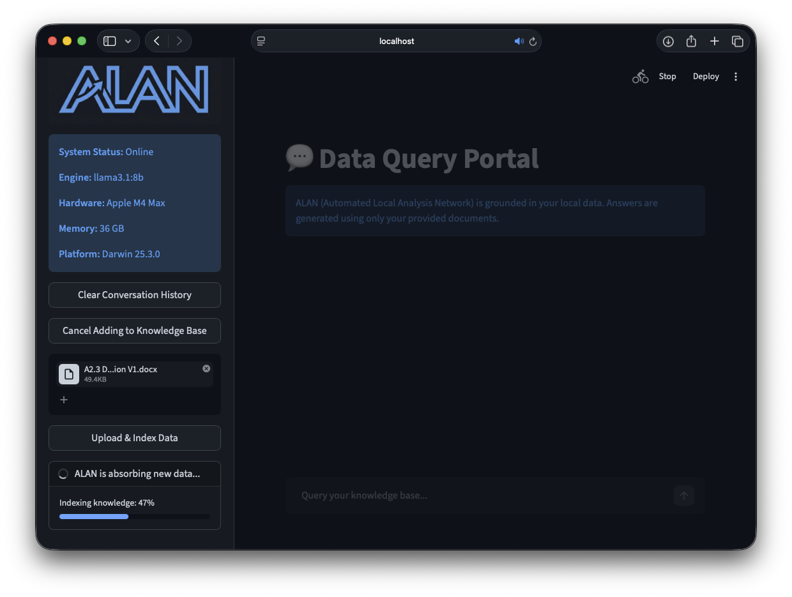

# ALAN: Automated Local Analysis Network 🤖

ALAN is a private, local-first RAG (Retrieval-Augmented Generation) assistant designed to provide data insights directly from a user's local directory without ever sending data to the cloud. Built to leverage the high-performance Neural Engine of Apple Silicon (M4 Max), ALAN allows for secure querying of PDFs, Word documents, and Excel spreadsheets.

---

## 🚀 Overview

The project consists of a high-performance Python backend (`engine.py`) utilizing LangChain and ChromaDB, and a modern, telemetry-aware frontend (`app.py`) built with Streamlit. ALAN uses the **Llama 3.1 8B** model via Ollama for synthesis and **mxbai-embed-large** for high-accuracy semantic search.  

### Key Features:
* **Privacy-First Architecture:** 100% local execution. No API keys or internet connection required for querying.
* **Multi-Format Ingestion:** Seamlessly processes `.pdf`, `.docx`, `.xlsx`, and `.txt` files.
* **Source Attribution:** Every answer includes citations from the specific source document to prevent hallucinations.
* **Hardware Telemetry:** Real-time monitoring of host system specs (CPU/RAM/OS) displayed in the UI.
* **Batch Indexing:** Optimized ingestion pipeline to handle large document libraries without system timeouts.
* **Real-Time Knowledge Management:** Integrated in-app file uploader with automated batch-indexing and vector database synchronization.
* **Interactive UI Feedback:** Dynamic progress tracking for data ingestion and a "smart" library manager with real-time file counts.


Figure 1: Screenshot of the ALAN web UI

---

## 🛠️ Technology Stack

* **Language:** Python 3.13
* **LLM Orchestration:** LangChain / LangChain-Ollama
* **Local LLM:** Ollama (Llama 3.1 8B)
* **Embeddings:** mxbai-embed-large
* **Vector Store:** ChromaDB
* **Frontend:** Streamlit

---

## 📂 Project Structure

```text
ALAN/
├── app.py                # Streamlit UI & Hardware Monitoring
├── engine.py             # RAG Pipeline & Ingestion Logic
├── requirements.txt      # Project Dependencies
├── .streamlit/
│   └── config.toml       # Custom UI Theme Configuration
├── data/                 # User documents (PDF, DOCX, XLSX)
└── vector_store/         # Persisted ChromaDB embeddings
```

---

## ⚙️ Setup & Installation

**1. Install Ollama:** <br>
Download and install from [ollama.com](ollama.com). Pull the necessary models:
```bash
ollama pull llama3.1:8b
ollama pull mxbai-embed-large
```

**2. Clone the repository:**<br>
```bash
git clone [https://github.com/b-cassidy/ALAN.git](https://github.com/b-cassidy/ALAN.git)
cd ALAN
```

**3. Install Dependencies**
```bash
pip install -r requirements.txt
```

**4. Ingest Data:**
Place the documents you wish to be available to ALAN in the /data folder and run the ingestion script:
```bash
python3 -c "from engine import AlanEngine; alan = AlanEngine(); print(alan.ingest_data())"
```

**5. Launch ALAN:**
```bash
streamlit run app.py
```